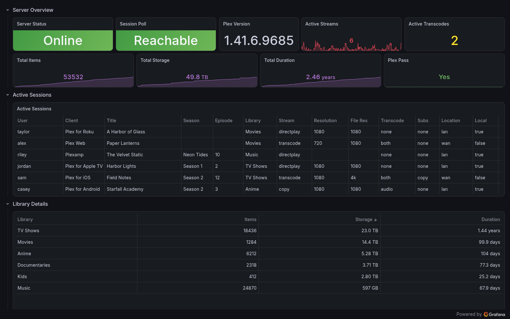

# plex-exporter

[](https://github.com/cplieger/plex-exporter/pkgs/container/plex-exporter) [](https://github.com/cplieger/plex-exporter/pkgs/container/plex-exporter) [](https://github.com/cplieger/plex-exporter/blob/main/Dockerfile) [](https://github.com/cplieger/plex-exporter/issues?q=label%3Agremlins-tracker) [](https://github.com/cplieger/plex-exporter/releases)

<!-- hub-overview BEGIN -->
plex-exporter puts your Plex server's streams, transcodes, bandwidth and library sizes into Prometheus, so you can watch them in Grafana and get alerts. It only reads from Plex. Your own Prometheus and Grafana store and show the data.



## What it does

plex-exporter lets you follow your Plex server in Grafana and get alerts when it has a problem.

- Shows who is watching what, on which device, and whether it plays directly or is transcoded.
- Tracks each stream's bandwidth and bitrate, and whether the viewer is local or remote.
- Counts the items, total length and disk space of each library.
- Adds host CPU, memory and total bandwidth on a server with Plex Pass.
- Comes with a Grafana dashboard and nine alert rules, one of them for a revoked token.

## Who it is for

plex-exporter is built for Plex server owners who already run Grafana and Prometheus, or another Prometheus-compatible scraper such as Grafana Alloy. It checks Plex for streams every 5 seconds, so a new stream appears within seconds.

You need a Plex Media Server and its admin token, plus a scraper and Grafana, which this image does not include. Run one container for each Plex server. Its metrics page has no login, so keep it on your own network.

Consider [Tautulli](https://github.com/Tautulli/Tautulli) if you want a web app made for Plex, with watch history, per-user statistics and notifications for streams and recently added media.

plex-exporter is free software under the GPL-3.0-or-later license.
<!-- hub-overview END -->

## Quick start

The image is on GitHub Container Registry and Docker Hub, for `amd64` and `arm64`. Both have the same images and tags. This is the [`compose.yaml`](compose.yaml) in this repository.

```yaml
services:
  plex-exporter:
    image: ghcr.io/cplieger/plex-exporter:latest
    container_name: plex-exporter
    restart: unless-stopped

    # Set both values in a .env file next to this one before the first start.
    environment:
      - PLEX_URL  # the address you open Plex at from another device, such as http://192.0.2.10:32400
      - PLEX_TOKEN  # your Plex admin token, found with Plex's guide "Finding an authentication token"

    ports:
      - "9594:9594"
```

1. Sign in to Plex Web as the server's owner and find your token with Plex's guide, [Finding an authentication token](https://support.plex.tv/articles/204059436-finding-an-authentication-token-x-plex-token/).
2. Next to `compose.yaml`, create a file named `.env` with these two lines. Put in your token and the address you open Plex at from another device on your network, not `localhost`.

   ```text
   PLEX_URL=http://192.0.2.10:32400
   PLEX_TOKEN=your-plex-token
   ```

   Use `http://plex:32400` only when your Plex container is named `plex` and shares a Docker network with this one.
3. Run `docker compose up -d`.
4. Add this scrape job to your Prometheus configuration, with your Docker host's address in place of `192.0.2.20`. The shipped alert rules expect the job name `plex-exporter`.

```yaml
scrape_configs:
  - job_name: plex-exporter
    static_configs:
      - targets: ["192.0.2.20:9594"]
```

Run `docker logs plex-exporter`. You should see `connected to plex server` with your server's name. If you see `cannot connect to plex server` with `401 Unauthorized`, the token is wrong.

On Unraid, open the **Apps** tab, search for plex-exporter and click **Install**.

## Adding the Grafana dashboard

The repository ships [`grafana-dashboard.json`](grafana-dashboard.json), a dashboard built on these metrics.

1. In Grafana, open **Dashboards**, click **New**, then **Import**.
2. Upload `grafana-dashboard.json` and choose your Prometheus data source.

Take the file from the release that matches your image tag, because each release's dashboard matches the metrics that image serves. Its `uid` stays the same, so importing a newer copy updates the dashboard in place. [Monitoring and alerts](docs/monitoring.md#dashboard) lists the release download and the OCI artifact for automated delivery.

## Configuration reference

Every setting is an environment variable, read once at start. Run `docker compose up -d` again after a change.

| Variable | Description | Default |
| --- | --- | --- |
| `PLEX_URL` | Your Plex server's address with scheme and port, such as `http://192.0.2.10:32400` | required |
| `PLEX_TOKEN` | The admin token of your Plex server. Leave it out when `PLEX_TOKEN_FILE` is set | required |
| `PLEX_TOKEN_FILE` | Path to a file holding the token, such as a Docker secret. It takes precedence over `PLEX_TOKEN` and keeps the token out of `docker inspect` | _(unset)_ |
| `LISTEN_ADDR` | Address and port the metrics server listens on | `:9594` |
| `PLEX_CA_CERT_PATH` | Path inside the container to the PEM file of the CA that signed your Plex certificate. TLS verification stays on | _(unset)_ |

The exporter strips one trailing line ending from the token file, and refuses to start when the file holds only whitespace.

Which TLS setting you need depends on your `PLEX_URL`:

| Your `PLEX_URL` looks like | What to do |
| --- | --- |
| `http://plex:32400` or another `http://` address | Nothing, because TLS is not in use |
| `https://<hash>.plex.direct:32400`, with Plex's own certificate | Nothing, because a public CA signed it |
| `https://192.0.2.10:32400` or `https://plex.local`, with a self-signed or private CA | Mount the CA's PEM file and set `PLEX_CA_CERT_PATH` to its path |

| Port | Description |
| --- | --- |
| `9594` | Prometheus metrics at `/metrics` and the health check at `/api/health` |

The exporter needs no volumes.

## Security

Keep port 9594 on your own network. The metrics page has no login, and its labels carry Plex user names, device names and the titles being played.

The exporter only connects out, to the Plex server you configure. It sends the token in a request header, never logs it and never puts it in a metric. TLS verification always stays on, and `PLEX_CA_CERT_PATH` adds a private CA instead of turning verification off. The image runs as a non-root user on a distroless base, with no shell or package manager.

[Security](docs/hardening.md) covers the read-only compose settings, the limits the exporter enforces and what the image contains.

## Troubleshooting

The image's healthcheck runs `/plex-exporter health`, which reads a marker file the exporter writes in `/tmp` once its metrics server is listening. `/api/health` reads the same marker and answers 503 while the exporter starts or stops.

At startup, the container exits on an error only you can fix, and Docker restarts it. That is a rejected token, any other 4xx status except 408 and 429, a certificate problem or a listen port it cannot bind. On a DNS error, a timeout, a 408, a 429 or a 5xx, it starts anyway with `plex_http_reachable` at `0`. Once started, it keeps running through Plex errors and retries every 5 seconds.

- The log shows `cannot connect to plex server` with `401 Unauthorized`. The token is wrong or revoked, so find it again with step 1 of the quick start.
- The log shows `initial plex connection failed; starting in degraded state`. The exporter cannot reach `PLEX_URL` yet, so try that address from another device.
- Host CPU, memory and `plex_transmit_bytes_total` are missing. They need Plex Pass, and appear once Plex has answered for them.
- With `read_only: true` in your compose file, `/api/health` answers 503. Mount a writable `/tmp`, as [Security](docs/hardening.md#read-only-root-filesystem) shows.
- A library's item count lags after a large scan, because counts are read every 15 minutes.

## Monitoring

plex-exporter serves 16 metrics on `/metrics`, for the exporter itself, the server, its libraries and each stream. Each stream adds at most four series, and the exporter tracks 256 streams at most. Six PromQL alert rules ship in [`alerts/promql.yaml`](alerts/promql.yaml), and three LogQL rules for the container log in [`alerts/logql.yaml`](alerts/logql.yaml). [Monitoring and alerts](docs/monitoring.md) lists every metric and rule and shows how to load them.

## Documentation

- [How plex-exporter works](docs/how-it-works.md) explains how often it reads Plex and when each metric appears.
- [Monitoring and alerts](docs/monitoring.md) lists every metric and label, the dashboard downloads and the alert rules.
- [Security](docs/hardening.md) covers the read-only compose settings, the exporter's limits and what the image contains.
- [Running on Kubernetes](docs/kubernetes.md) covers the `/tmp` mount, probes, a sidecar setup and Prometheus Operator labels.

## Credits

- The metric and label names follow [prometheus-plex-exporter](https://github.com/jsclayton/prometheus-plex-exporter) by [@jsclayton](https://github.com/jsclayton), the Grafana Hackathon 2022 exporter this project builds on.
- The `plex_library_items` metric with its `content_type` label, and the `transcode_type` and `subtitle_action` labels, follow the [@timothystewart6 fork](https://github.com/timothystewart6/prometheus-plex-exporter) of that exporter.
- It reads the [Plex Media Server API](https://developer.plex.tv/pms/) and serves its metrics with [prometheus/client_golang](https://github.com/prometheus/client_golang), the Go client library for Prometheus.

## Contributing

See [CONTRIBUTING.md](CONTRIBUTING.md).

## Disclaimer

This project is built with care and follows security best practices, but it is intended for personal / self-hosted use. No guarantees of fitness for production environments. Use at your own risk.

This project was built with AI-assisted tooling using [Claude](https://claude.com), [GPT](https://openai.com), and [Kiro](https://kiro.dev). The human maintainer defines architecture, supervises implementation, and makes all final decisions.

## License

GPL-3.0-or-later. See [LICENSE](LICENSE). The image carries the license text of every bundled component under `/usr/share/licenses/`.

Third-party attributions are in [THIRD_PARTY_NOTICES.md](THIRD_PARTY_NOTICES.md).
